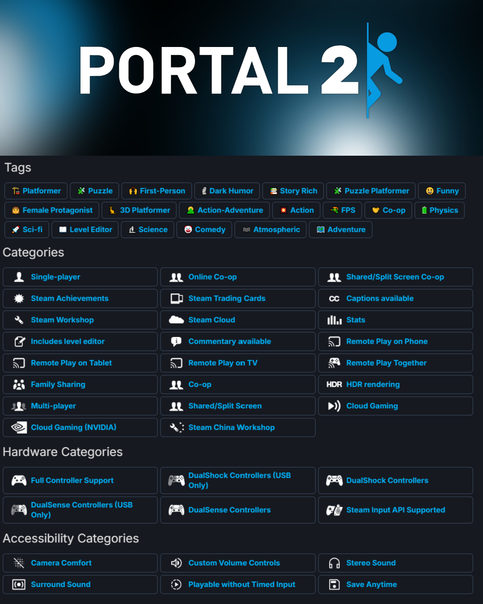

```{r setup, include=FALSE}
knitr::opts_chunk$set(echo = TRUE)
```

# Avant l'analyse...

## Importation des données

Dans cette partie, on doit importer les données dans les différents fichiers et réaliser tout le nécessaire afin d'obtenir un dataframe avec toutes les informations que l'on veut afin de l'exploiter pour notre analyse et nos visualisations.

Ce que l'on a à faire :

- Tous les tableaux partagent une colonne commune : app_id, qui sera utilisée pour les jointures. On va alors créé un grand dataframe avec l'ensemble des variables que l'on veut exploiter.
- Certaines colonnes nécessitent un nettoyage, notamment la colonne initial_price contenant parfois la valeur "\\N"
- Regrouper les tags et les catégories sur une même ligne (meêm app_id) des fichiers tags.csv et categories.csv : les colonnes tags et categories seront des chaînes de caractères contenant l'ensemble des tags/catégories séparé chacun par une virgule
- Convertir l'initial_price en une donnée exploitable dans steamspy.csv (ex : 999 veut dire 9.99 USD)

```{r init, echo=FALSE, include=FALSE}
print(getwd())

# Importer les libraries
library(ggplot2)
library(tidyr)
library(stringr)
library(dplyr)

# Regrouper les genres des fichiers categories et tags sous une même ligne
tags <- read.csv("data/tags.csv") %>% 
  group_by(app_id) %>% 
  summarize(tags = paste(tag, collapse = ","))

categories <- read.csv("data/categories.csv") %>% 
  group_by(app_id) %>% 
  summarize(categories = paste(category, collapse = ","))

# Importer les autres tableaux

# Cas pour steamspy : initial price est intéressant mais price est déjà présent dans clean_games

# On va enlever la colonne price et convertir la colonne initial_price pour qu'elle soit uitilisable
steamspy <- read.csv("data/steamspy.csv") %>% 
  select(-price, - languages) %>% 
  mutate(initial_price = na_if(initial_price, "\\N"))

initial_prices <- steamspy %>% 
  transmute(initial_price_USD = ifelse(!is.na(initial_price), as.double(initial_price) / 100, NA))

steamspy <- steamspy %>% 
  cbind(initial_prices) %>% 
  select(-initial_price)

# Import de clean_games
clean_games <- read.csv("data/clean_games.csv", sep=";")

# Créer un dataframe contenant toutes les informations en réalisant des jointures
steamData <- left_join(clean_games, steamspy, by="app_id") %>% 
  left_join(tags, by="app_id") %>% 
  left_join(categories, by="app_id")

# Mettre les tags et catégories en lowercase pour les str_detect
steamData <- steamData %>%
  mutate(
    # Nettoyer les champs : enlever les espaces superflus, mettre en minuscules pour str_detect
    categories = str_to_lower(str_trim(categories)),
    tags = str_to_lower(str_trim(tags))
  )
```
## Différences entre "Catégorie" et "Tag"

Sur Steam, il existe deux types de variables qui permettent de classer les jeux présents sur la plateforme :

- Catégories : classifications officielles attribuées par Steam. Elles décrivent les fonctionnalités principales d'un jeu (par exemple : Multijoueur, Succès Steam, Support manette, Mode coopératif, etc.). Ce sont des critères souvent liés à l'expérience utilisateur et aux fonctionnalités techniques du jeu.

- Tags : classifications collaboratives créées par les utilisateurs de Steam. Ils permettent de décrire le contenu, l'ambiance ou le style d'un jeu (par exemple : Puzzle, Narratif, Indépendant, FPS, Monde ouvert, etc.). Les tags sont plus subjectifs et peuvent varier en popularité selon la communauté.



# Analyse

## Contexte et problématique

C'est sur la plateforme Steam que l'on a vu naître les premiers jeux en ligne et le dévelopement de celui-ci avec des jeux mythiques comme Counter Strike, Team Forteress, etc...
D'autres types de jeu sont aussis devenus populaire au cours du temps comme les MMORPG, les Battle-Royale, etc...
Nous voulons voir les tendances actuelles et quels types de jeux attirent principalement les joueurs de Steam.

Notre problématique est alors la suivante :

Quel est les types de jeu en ligne les plus populaires sur Steam ? (FPS, MMO, etc...)

## Définition de jeu en ligne

Une définition de jeu en ligne sera un jeu vidéo dont l'expérience se repose sur l'intéraction entre plusieurs joueurs en temps réel.
On distingue différents types de jeu en ligne :

- MMO (Massive Multiplayer Online)
- Jeux coméptitifs (FPS, MOBA, Battle Royale)
- Jeux collaboratifs (Eurotruck 2)

### Critères "jeu en ligne" :

Dans nos données, nous identifierons un jeu comme "jeu en ligne" s'il possède les catégories ou tags suivants :

- "Multi-player", "Massively Multiplayer", "Online Co-op", ou d'autres tags associés.

### Critère "popularité" :

Le critère "popularité" sera basée sur le nombre de joueurs actifs en Octobre 2024.

### Types de jeux en ligne

Pour analyser les type de jeux les plus populaires pour les jeux en ligne et de regarder sa distribution dans le magasin Steam, on va considérer les tags suivants uniquement :

- FPS Multijoueur
- Battle Royale
- RPG en ligne
- Coopération en ligne
- Sandbox
- Survival Multiplayer
- Autres (correspondant aux autres tags non classés)

```{r get_infos_online_games, include=FALSE}
# Détecter les jeux multijoueurs
jeux_en_ligne <- steamData %>%
  filter(
    (
      str_detect(str_to_lower(categories), "multiplayer|massively multiplayer|online co-op") |
      str_detect(str_to_lower(tags), "multiplayer|mmo|online co-op|pvp|battle royale")
    )
  )

# Classer les jeux en type général selon leur tags
jeux_en_ligne_type <- jeux_en_ligne %>%
  mutate(
    type_de_jeu = case_when(
      str_detect(str_to_lower(tags), "battle royale") ~ "Battle Royale",
      str_detect(str_to_lower(tags), "moba") ~ "MOBA",
      str_detect(str_to_lower(tags), "mmorpg|rpg") ~ "RPG en ligne",
      str_detect(str_to_lower(tags), "survival") ~ "Survival Multijoueur",
      str_detect(str_to_lower(tags), "fps") & str_detect(str_to_lower(tags), "shooter") ~ "FPS Multijoueur",
      TRUE ~ "Autres"
    )
  )

# Grouper par type de jeu et compter les joueurs + le nombre de jeux
popularite_types <- jeux_en_ligne_type %>%
  group_by(type_de_jeu) %>%
  summarise(
    total_joueurs_actifs = sum(concurrent_users_yesterday, na.rm = TRUE),
    nombre_de_jeux = n(),
    .groups = 'drop'
  ) %>%
  arrange(desc(total_joueurs_actifs))

```


## Analyse des résultats

Voici la répartition des joueurs sur la plateforme Steam sur les jeux en lignes :

```{r barchart,  echo=FALSE, fig.align='center'}
ggplot(popularite_types, aes(x = reorder(type_de_jeu, total_joueurs_actifs), y = total_joueurs_actifs, fill = type_de_jeu)) +
  geom_col(show.legend = FALSE) +
  coord_flip() +
  theme_minimal() +
    scale_fill_brewer(palette = "Set2") +
  geom_text(aes(label = format(total_joueurs_actifs, big.mark = " ")),
            position = position_stack(vjust = 0.5),
            hjust = 0.5) +
  labs(title = "Total des joueurs actifs par type de jeu",
       x = element_blank(),
       y = "Nombre de joueurs actifs (Octobre 2024)")
```

### Observations

On voit que le genre de jeu en ligne le plus populaire sur Steam est le FPS Multijoueur rassemblant plus d'un tiers des joueurs des jeux en ligne sur Steam représentant 1,5 millions de joueurs avec CS 2 qui représente plus de 1,1 millions de joueurs. 

Ensuite, dans la catégorie "Autres", On y compte 1,3 millions joueurs sur des jeux comme Liar's Bar, War Thunder, Civizilation VI, Forza Horizon et Eurotruck Simulator 2. C'est une catégorie regroupant pleins de genres différents.

Ensuite, les Battle Royale occupent rassemble 1 million de joueurs (environ 16,5% des joueurs). Le genre semble être resté populaire mais elle n'a pu la même popularité qu'entre 2018-2020.

Les RPG en ligne représente 1.2 million de joueurs mais il faut distinguer les différents genre de RPG en ligne.

En effet, dans les RPG en ligne, ils se trouvent les MMO comme Monster Hunter: World, New World: Aeternum ou Destiny 2 mais également des RPG qui peut se jouer en coopération comme Stardew Valley, Baldur's Gate 3, etc...

Voici la répartition des joueurs jouant à des MMORPG et des joueurs d'RPG classique : 

```{r mmo_vs_classicRPG, echo=FALSE, fig.align='center'}
# Filtrer les jeux RPG en ligne et ajouter une colonne is_MMO
mmo_vs_classicRPG <- jeux_en_ligne_type %>%
  filter(type_de_jeu == "RPG en ligne") %>%
  mutate(is_MMO = case_when(
    str_detect(str_to_lower(tags), "mmorpg") ~ TRUE,  # Si le tag "mmorpg" est présent
    TRUE ~ FALSE
  ))

# Calculer le total de jeux RPG en ligne
total_jeux_rpg <- nrow(mmo_vs_classicRPG)

# Regrouper les données pour calculer les proportions globales
proportions_globales <- mmo_vs_classicRPG %>%
  group_by(is_MMO) %>%
  summarise(proportion = n()/total_jeux_rpg)

# Créer le graphique avec les pourcentages sur les barres
ggplot(proportions_globales, aes(x = "", y = proportion, fill = is_MMO)) +
  geom_bar(stat = "identity", width = 0.8) +
  scale_fill_manual(
    values = c("FALSE" = "#4DAF4A", "TRUE" = "#FF7F00"),
    name = "Type de jeu", 
    labels = c("RPG en ligne (non MMO)", "MMORPG")  
  ) +
  geom_text(
    aes(label = scales::percent(proportion, accuracy = 0.1)), 
    position = position_stack(vjust = 0.5)
  ) +
  labs(
    title = "Proportion des jeux MMORPG et RPG en ligne (non MMO)",
    x = "", 
    y = "Proportion (%)"
  ) +
  theme_minimal() +
  theme(
    axis.text.x = element_blank(),
    axis.title.x = element_blank()
  )
```

Note : Stardew Valley a le tag RPG et est un jeu qui peut se jouer en multijoueur mais peut-on considérer comme un jeu en ligne ? C'est le cas d'autres jeux principalement singleplayer mais qui peut se jouer en multijoueur.

Les Survival Multijoueur représente une base de 800 000 joueurs sur des jeux fars comme Rust, Factorio, Satisfactory, etc...

Enfin, les MOBA représente uniquement moins de 550 000 joueurs dont la majorité des joueurs viennent de Dota 2 (500 000 joueurs).

### Limites de résultats obtenus

- Les tags Steam et les catégories crées ne sont pas assez précise pour trouver les jeux en ligne car on se retrouve souvent à la frontière d'un jeu avec un système multijoueur et un jeu en ligne.

- D'autres visualisations au sein des catégories nous permettraient de voir qu'uniquement quelques jeux portent la base de jeu de certain type de jeu comme CS 2 pour les FPS et Dota 2 pour les MOBA.

- Le fait que la catégorie "Autres" possèdent de nombreux jeux en ligne que l'on a pas pu classer montre que le domaine des jeux en ligne est très variée et non cantonnée aux genres que l'on pense habituellement. Globalement, réaliser une classication sur l'ensemble des jeux Steam semble difficile tant certains jeux sont assez particulier pour les catégoriser.

- Enfin, il faut être conscient que ces données ne concernent que les utilisateurs Steam et non la globalité des joueurs. Par exemple, pour les MMORPG, ceux-ci peuvent être lancé hors Steam. De plus avec l'avènement de l'Epic Game Store, une partie des jeux sont passés sur l'autre plateforme comme Rocket League.

